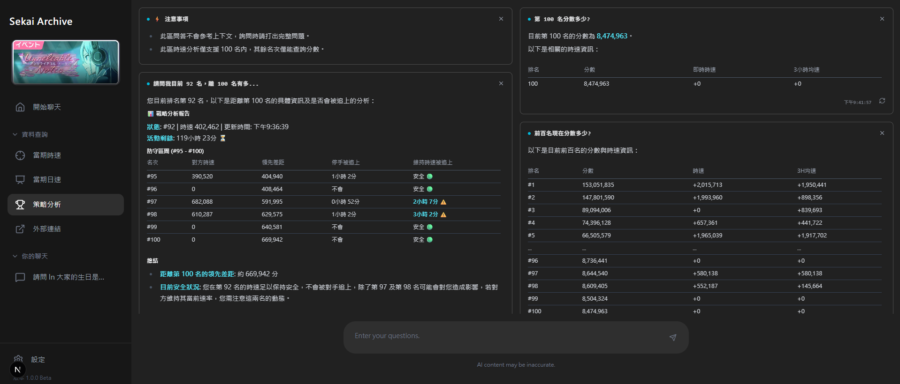

# Sekai Archive

### An Intelligent Event Strategy Assistant for Project Sekai

 

### [View Live Demo](https://sekai-archive.vercel.app/)

## Preview

## Why I Made This

I built this project because I really love the game. Also to solve the pain points of tracking live event rankings and calculating "safe distances" during competitive events. It serves as a comprehensive full-stack portfolio piece to practice LLM Agent Architecture (Router -> Tool -> Response), RAG, and Serverless deployment on Vercel.

## Features

- ✅ **AI Command Center**: Intelligent routing between general chat and data tools.
- ✅ **Judge Agent**: A lightweight model quickly classifies user intent (Chat vs. Query) to reduce latency.
- ✅ **Cost-Optimized Tools**: Implemented "Range Filtering" in API calls to prevent context window overflow.
- ✅ **Observability**: Full audit logging system tracking Input/Output Tokens, Latency, and Cost USD per request.
- ✅ **Real-time Agent UI State Streaming**: Built a custom NDJSON streaming parser on the frontend to display the AI's internal thoughts and tool-calling status in real-time, significantly improving UX.
- ✅ **RAG-Powered Lore & System DB**: Implemented Vector Similarity Search using Supabase RPC to accurately answer complex questions about character lore, unit backgrounds, and game systems.
- ✅ **Parallel Tool Calling & Jargon Handling**: Engineered prompt definitions to trigger parallel multi-hop reasoning, successfully translating game-specific jargon/slang into standard queries for high-precision retrieval.
- ✅ **Enterprise-grade Security**: Secured API routes using JWT verification, Upstash Redis Rate Limiting, and Vercel IP/Country tracking.

## ⚡ Tech Stack

- **Framework:** Next.js 16 (App Router)
- **Database & Logs:** Supabase (PostgreSQL + RLS + pgvector)
- **AI Engine:** OpenAI API (GPT-4.1-mini & text-embedding-3-small)
- **Infrastructure:** Vercel (Edge & Serverless Functions), Upstash (Redis Rate Limiting)
- **Styling:** Tailwind CSS v4, Framer Motion, Recharts
